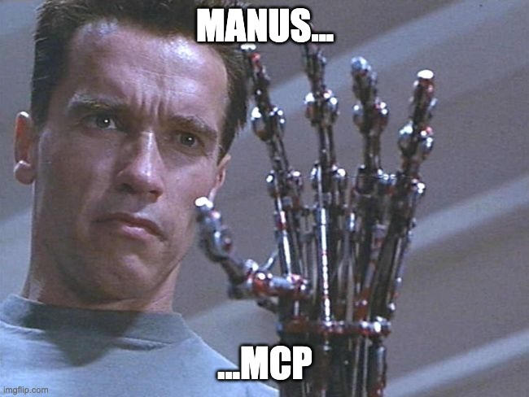

# Manus MCP (Enhanced Fork)

<p align="center">
  
</p>

A Model Context Protocol (MCP) server implementation that can browse the web, perform search queries, and execute code. This is an enhanced fork with improved Windows compatibility and fixed stdio transport communication.

## ✨ Recent Improvements

This fork includes several critical fixes and enhancements:

- **Switched browse_web to ChromeBrowser** - Replaced browser-use/Playwright with Chrome DevTools Protocol for direct browser connection
- **Chrome Debug Interface Integration** - Now connects to running Chrome instance on localhost:9222/9229 for true "headless=no" experience
- **Fixed MCP stdio transport communication** - Resolved JSON parsing errors in Claude Desktop
- **Enhanced logging system** - All logs now properly redirected to avoid stdio contamination
- **Improved Windows WSL compatibility** - Better support for Windows users via WSL
- **Disabled telemetry output** - Prevented browser-use library from interfering with MCP protocol
- **Comprehensive .gitignore** - Protected sensitive data like API keys and personal information

## Current Features

- "google_search" tool that performs Google searches and returns relevant links
- "browse_web" tool that allows browsing websites, clicking elements, and extracting content
- "code_interpreter" tool that allows reading, writing, and executing code in a sandbox environment
- "bash_tool" tool that allows running shell commands in the sandbox directory

## Using with Claude for Desktop

### Windows Users (WSL)

For Windows users using WSL, use this configuration in your Claude Desktop config:

1. Create or edit the Claude for Desktop configuration file:
   - Windows: `%APPDATA%\AnthropicClaude\claude_desktop_config.json`

2. Add the following configuration:
   ```json
   {
     "mcpServers": {
       "manus-mcp": {
         "command": "wsl",
         "args": [
           "--distribution",
           "Debian",
           "--",
           "bash",
           "-c",
           "source /path/to/manus-mcp/.venv/bin/activate && python3 /path/to/manus-mcp/mcp_server.py"
         ],
         "name": "Manus MCP",
         "description": "Enhanced MCP server with web browsing, search, and code execution capabilities",
         "disabled": false,
         "timeout": 60,
         "transportType": "stdio"
       }
     }
   }
   ```

### macOS/Linux Users

1. Create or edit the Claude for Desktop configuration file:
   - macOS: `~/Library/Application Support/Claude/claude_desktop_config.json`
   - Linux: `~/.config/Claude/claude_desktop_config.json`

2. Add the following configuration:
   ```json
   {
     "mcpServers": {
       "manus-mcp": {
         "command": "uv",
         "args": [
           "--directory",
           "/ABSOLUTE/PATH/TO/manus-mcp",
           "run",
           "mcp_server.py"
         ],
         "name": "Manus MCP",
         "description": "Enhanced MCP server with web browsing, search, and code execution capabilities"
       }
     }
   }
   ```

3. Restart Claude for Desktop

4. You should now see the Manus MCP tools available in Claude for Desktop

## Available Tools

### hello_world

A simple greeting tool that returns a welcome message.

### google_search

Performs Google searches and returns a list of relevant links.

### browse_web

Connects directly to your running Chrome browser via Chrome DevTools Protocol for real-time web interaction. Requires Chrome to be running with debug interface enabled (--remote-debugging-port=9222). Supported actions:
- `navigate`: Go to a specific URL in your actual Chrome browser
- `get_content`: Extract page content using BeautifulSoup
- `fetch`: Fetch webpage content without navigation
- `execute_js`: Execute JavaScript code in the browser
- `scroll`: Scroll the page by specified amount

**Setup**: Start Chrome with debug interface:
```bash
google-chrome --remote-debugging-port=9222 --remote-debugging-address=127.0.0.1
```

### code_interpreter

Allows reading, writing, and executing code files in a sandboxed environment. Supported actions:
- `read`: Read the contents of a file
- `write`: Write content to a file
- `execute`: Execute a file or code snippet
- `list`: List files in the sandbox

Supports multiple programming languages including Python, JavaScript (Node.js), Bash, Ruby, Perl, and R.

### bash_tool

Executes bash commands in the sandbox directory. Features:
- Run commands in foreground or background mode
- Start web servers and other long-running processes
- Install packages and dependencies
- Manage files and processes

## Environment Variables

The following environment variables can be configured:

- `SANDBOX_DIR`: Path to the sandbox directory (default: `~/manus-sandbox`)
- `GLOBAL_TIMEOUT`: Global timeout for all operations in seconds (default: 60)
- `CHROME_MCP_HOST`: Chrome DevTools Protocol host (default: localhost)
- `CHROME_MCP_PORT`: Chrome DevTools Protocol port (default: 9229)
- `GOOGLE_SEARCH_MAX_RESULTS`: Maximum number of search results to return (default: 10)
- `LOG_LEVEL`: Logging level (default: INFO)

## Logging

All logs are written to `~/manus-mcp-logs/manus-mcp.log` to avoid interfering with MCP's stdio transport. This ensures clean JSON communication between the server and Claude Desktop.

## Development Guide

### Prerequisites

- Python 3.11+
- [uv](https://github.com/astral-sh/uv) - Fast Python package installer and resolver

### Installation

#### Using Setup Script (Recommended)

```bash
./setup.sh
```

#### Manual Installation

1. Clone the repository
   ```bash
   git clone https://github.com/triepod-ai/manus-mcp.git
   cd manus-mcp
   ```

2. Create a virtual environment and install dependencies
   ```bash
   uv venv
   source .venv/bin/activate
   uv pip install -e .        # Install the project and its dependencies
   ```

3. Run the server
   ```bash
   # Make sure your virtual environment is activated
   source .venv/bin/activate
   python3 mcp_server.py
   ```

### Testing the Server

You can test the MCP server manually:

```bash
# Test basic startup (should produce no output)
source .venv/bin/activate
timeout 5s python3 mcp_server.py

# Test MCP handshake
echo '{"jsonrpc":"2.0","id":1,"method":"initialize","params":{"protocolVersion":"2024-11-05","capabilities":{},"clientInfo":{"name":"test","version":"1.0"}}}' | python3 mcp_server.py
```

### Development Dependencies

To install development dependencies:

```bash
uv pip install -e ".[dev]"
```

## Troubleshooting

### Common Issues

1. **JSON parsing errors in Claude Desktop**: This fork fixes the stdio transport issues that caused these errors.

2. **Browser automation fails**: Ensure you have the required browser dependencies installed.

3. **Permission errors**: Make sure the sandbox directory has proper write permissions.

4. **Import errors**: Ensure all dependencies are installed in the virtual environment.

### Logs

Check the log file for detailed error information:
```bash
tail -f ~/manus-mcp-logs/manus-mcp.log
```

## ChromeBrowser Migration

The browse_web tool has been migrated from browser-use (Playwright) to a custom ChromeBrowser implementation using Chrome DevTools Protocol. This change provides several benefits:

### Why We Switched

1. **X Server Issues**: The original browser-use implementation required X Server/display for GUI rendering, causing failures in headless environments
2. **True "Headless=No" Experience**: Direct connection to your actual Chrome browser provides real visual feedback
3. **Simplified Dependencies**: Removed Playwright dependency and complex browser automation setup
4. **Better Performance**: Direct DevTools Protocol communication is faster than browser automation layers

### Technical Details

- **Original**: browser-use library with Playwright backend
- **New**: Custom ChromeBrowser class using Chrome DevTools Protocol
- **Connection**: WebSocket connection to Chrome debug interface on port 9229
- **Content Extraction**: BeautifulSoup for HTML parsing and content extraction
- **Rollback Available**: Original implementation backed up in `mcp_server.py.backup`

### Migration Steps Taken

1. Created backup of original implementation
2. Replaced browser-use imports with ChromeBrowser
3. Updated environment variables from Playwright to DevTools Protocol configuration
4. Rewrote browse_web tool function to use ChromeBrowser methods
5. Updated tool actions to match ChromeBrowser capabilities
6. Tested connection and navigation functionality

### Files Modified

- `mcp_server.py`: Main tool implementation replaced
- `app/web_browser.py`: Fixed print statement for MCP protocol compatibility
- `rollback_plan.md`: Updated with new rollback procedures

## Original Repository

This is a fork of [huyouare/manus-mcp](https://github.com/huyouare/manus-mcp) with enhancements for better compatibility and reliability.

## API Documentation

The API follows the [Model Context Protocol (MCP) specification](https://modelcontextprotocol.io/).

## License

[MIT](LICENSE)